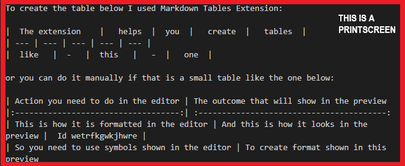

# GIT for dummies from Averina Irina

## Basic rules for formatting content in markdown:

1. __Lists__

    1.1. Unnumbered list can be created by adding a "*" sign at the beginning of the line with space between the sign and the text

    * __example of a text #1__
    * __example of a text #2__
    * __example of a text N__

     1.2. Numbered lists are created by adding a number followed by a dot at the biginnig of each point of the list with space between the dot and following text. This table of contents is a numbered list.

2. __Text formatting__

    2.1. Making text *italic*: text surrounded by two *'s or two _'s without spaces will be formatted as *italic with asterisks* / _italic with underliners_.

    2.2. Making text **bold**: text surrounded by two couples of *'s or _'s without spaces will be formatted as **bold with two asterisks** / __bold with two underliners__.

  3. __Tables__

Please, see the printscreen of the editor view to compare it with the preview below:

To create the table below I used Markdown Tables Extension:

|  The extension    |   helps  |  you  |   create  |   tables  |
| --- | --- | --- | --- | --- |
|  like   |  -   |  this   |   -  |   one  |

or you can do it manually if that is a small table like the one below:

| Action you need to do in the editor | The outcome that will show in the preview
|:-----------------------------------:| :----------------------------------------:
| This is how it is formatted in the editor | And this is how it looks in the preview |  Id wetrfkgwkjhwre | 
| So you need to use symbols shown in the editor | To create format shown in this preview
|If you need to leave come cells empty | Just keep the formatting as shown below

1. Lists

    1.1. Unnumbered list can be created by adding a "*" sign at the beginning of the line with space between the sign and the text

* example of a text #1
* example of a text #2
* example of a text N

    1.2. Numbered lists are created by adding a number followed by a dot at the biginnig of each point of the list with space between the dot and following text. This table of contents is a numbered list.

2. Text formatting

    2.1. Making text *italic*: text surrounded by two *'s without spaces will be formatted as *italic*

    2.2. Making text **bold**: text surrounded by two couples of *'s without spaces will be formatted as **bold**

    2.3. 

5. __Pictures__: to insert a picture first save the picture into the folder with your repository and then click and drag holding shift to insert the picture into the editor.  

6. __Quotes__: To create a blockquote, add a > in front of a paragraph.

    > like this :)

7. __Main commands__: please see the basic commands below or press Ctrl+Shift+P to see all the commands

8. __Work with remote repositories__: please, see the picture below to understand the basic commands to work with remotes.

Here are the main 5 git commands when working with remote repositories:

**1) git clone:** 
> The first command you need in order to start using a remote repository is the git clone command. To run the command, after “clone”, put the URL to the server’s .git file. Services like GitHub will give you the repository URL to copy in order to clone a repository. After you get the URL, and run the command, “git clone <url<url>>”, git creates a new directory to put the content of the repository. Now you can move into the repository and start working.

**2) git remote add:** 
> While the clone command is used to get an existing repository from a server, if you want to set up a remote server for a repository you have on your local machine, you will use the remote add command.

**3) git push:** 
> The git push command will take any of your local commits, and move them to the remote repository. We used it to move a new repository to the server. 

**4) git fetch:** 
> The fetch command is used to update any references to remote branches or tags. This means the you will bring those changes down from the remote server, and the local repository will be aware of the changes that have occurred, but the changes will not be made to the local repository branches.

**5) git pull:** 
> The last command is the pull command. The pull command is used to take any changes that have occurred on the remote repository, and move them into you local repository. When you run “git fetch”, the reference of the changes on the remote come down to you local repository. When you run “git pull”, you actually put the changes into your repository.

# THE END